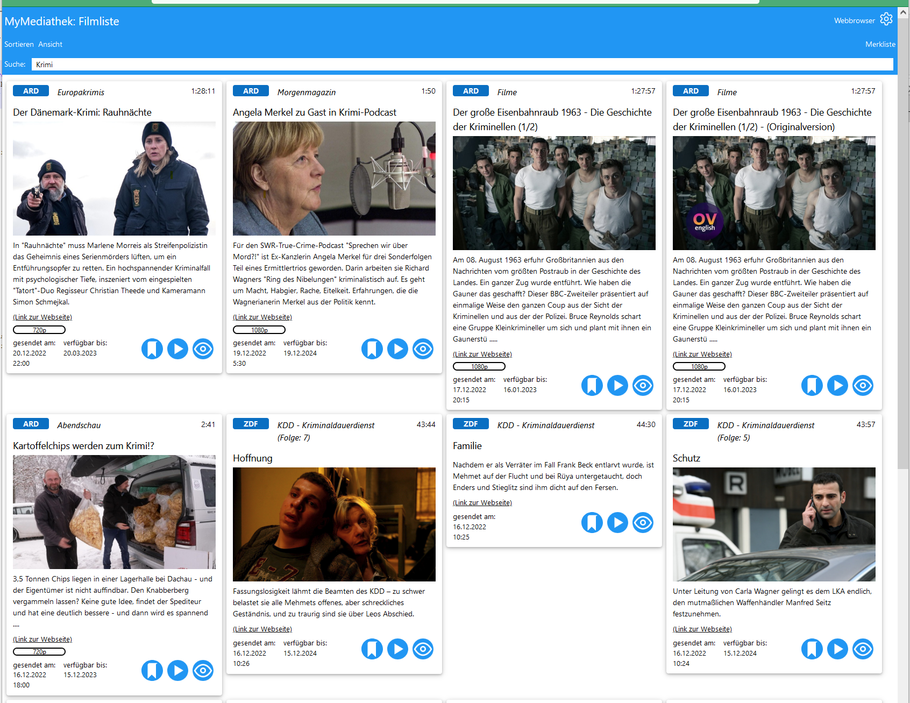
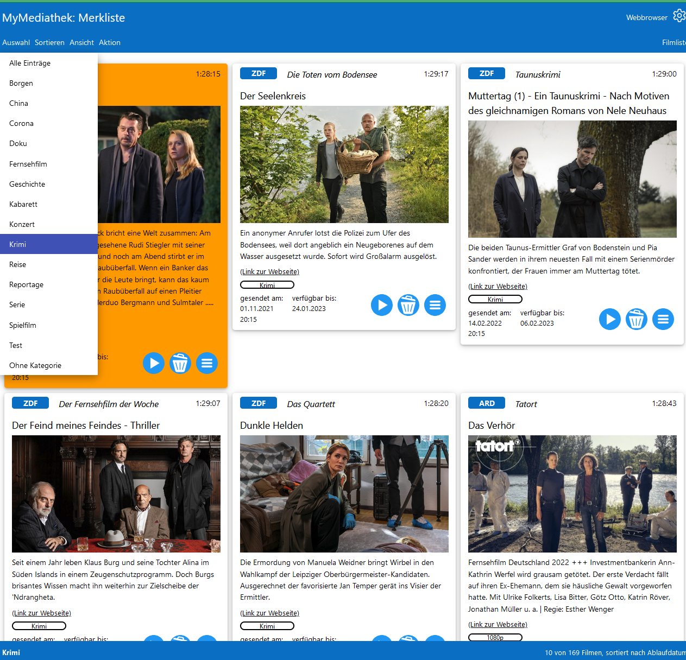
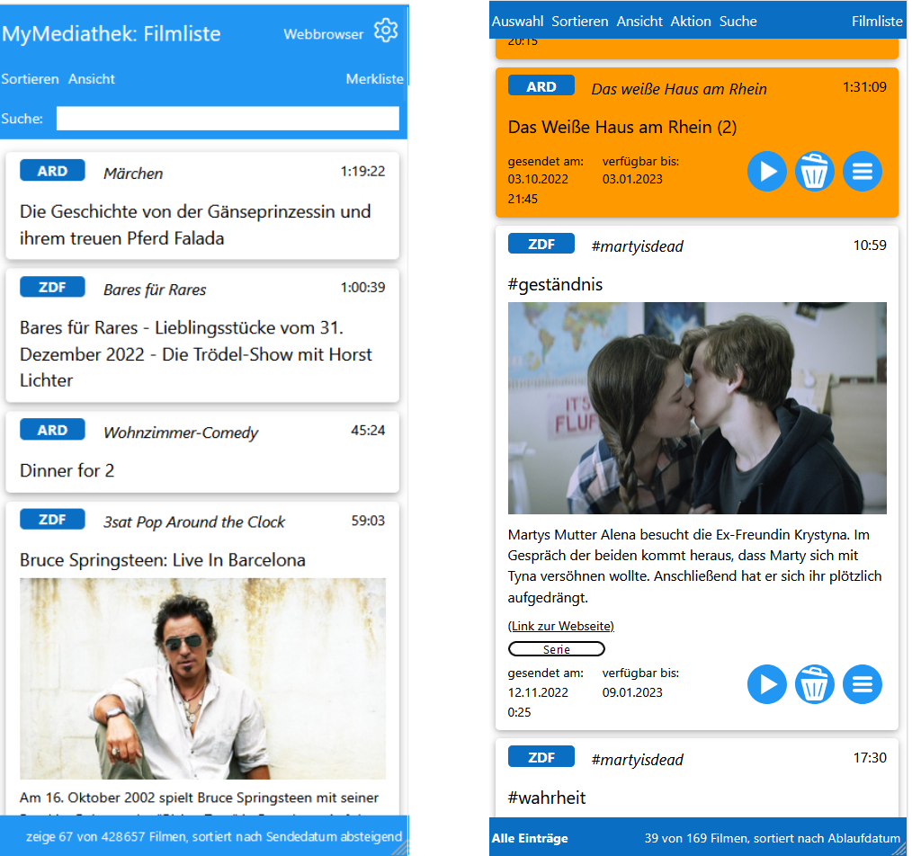

# MyMediathek

Übersicht - [Installation](docs/install.md) - [Bedienung](docs/usage.md) - [Verwaltung und erweiterte Konfiguration](docs/config.md) - [Webbrowser Add-On](docs/addon.md) - [Technische Details und Entwicklung](docs/develop.md)
***

MyMediathek ist eine private Mediathek mit der beliebige Beiträge aus den öffentlich-rechtlichen Mediatheken, wie ARD, ZDF, Arte, 3SAT, gesucht und lokal gemerkt werden, und sie dann später z.B. auf dem Fernseher wieder abzuspielen. Dabei wird nur nur die Information über die Beiträge gespeichert.

Die Anwendung stellt einen lokalen Webserver bereit, auf den von allen Geräten aus dem Heimnetzwerk mit dem bevorzugten Webbrowser zugegriffen werden kann.  Die Inhalte der Mediatheken werden im Webbrowser in einer übersichtlichen Filmliste dargestellt, die aus der Datenbank des [MediathekView](https://mediathekview.de/) Projektes erzeugt und mit zusätzlichen Informationen aus den Mediatheken, wie Vorschaubild und Verfügbarkeit ergänzt wird:

  

Beiträge können mit Hilfe der Filter und Sortieroptionen ausgesucht und in der Merkliste auf dem lokalen Webserver, sortiert in beliebige Kategorien, gespeichert werden.

  

Alle Beiträge sowohl aus der Filmliste wie die in der Merkliste gespeicherten Beiträge können dann zu einem beliebigen Zeitpunkt entweder im Browser, mit Hilfe von Chromecast oder mit einem externen Player wie KODI oder VLC auf dem Fernseher oder einen anderne Endgerät abgespielt werden.

Alternativ können mit einem Webbrowser Add-On direkt aus den Webseiten der ARD, ZDF, Arte, oder 3SAT Mediatheken in die lokale Merkliste übernommen werden:

  

Das Addon steht sowohl für Firefox als auch Chrome in den entsprechenden Web Stores zur Verfügung (für Download und Anleitung siehe [Webbrowser Add-On](docs/addon.md)).

Damit wird eine individuelle Mediathek nach eigenen Vorlieben erstellt, die im Heimnetzwerk jederzeit auf allen Geräten zur Verfügung steht. Durch die flexible Weboberfläche passt sich die Darstellung an alle Bildschirmgrößen, wie z.B. dem Handy an:

  

Alle Informationen stehen allen Benutzern zentral zur Verfügung, ohne das diese auf ihren Geräten eine spezielle Software installieren, oder Daten synchronisieren müssen.

  

### Features: ###

- Benutzerfreundliches Frontend für öffentliche rechtliche Mediatheken, mit erweiterten Such- und Sortieroptionen
- Anzeige von zusätzlichen Filminformationen wie Vorschaubild und Verfügbarkeit.
- Direktes Abspielen von Filmen auf dem Fernseher mit Hilfe von Chromecast oder konfigurierten Playern
- Abspeichern von Beiträgen in einer lokalen Merkliste mit freiwählbaren Kategorien.
- Farbige Markierungen für gemerkte und gesehene Filme, sowie für bald ablaufende bzw. abgelaufene Filme.
- Add-on um Filminformation auch direkt aus den Webseiten der ARD, ZDF und ARTE Mediathek in die Merkliste zu übernehmen.
- Flexible Darstellung für alle Bildschirmgrößen.

  

## Anleitungen und Informationen: ##

- ## [Installation](docs/install.md) ##
- ## [Bedienung](docs/usage.md) ##
- ## [Verwaltung und erweiterte Konfiguration](docs/config.md) ##
- ## [Webbrowser Add-On](docs/addon.md) ##
- ## [Technische Details und Entwicklung](docs/develop.md) ##

