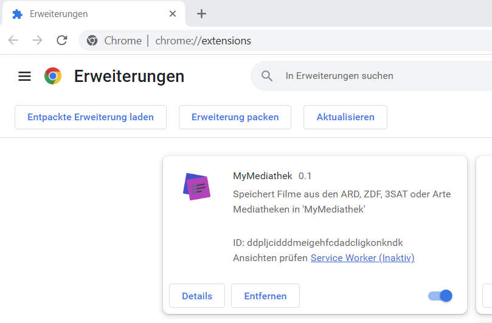
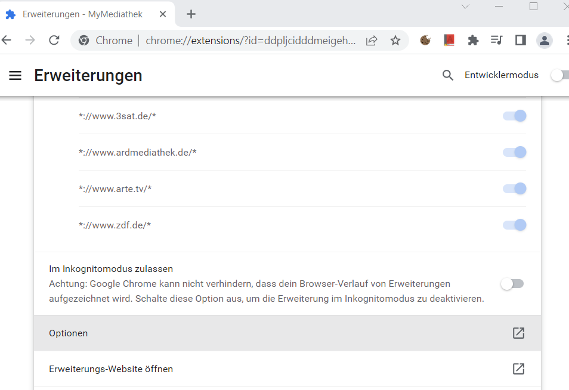
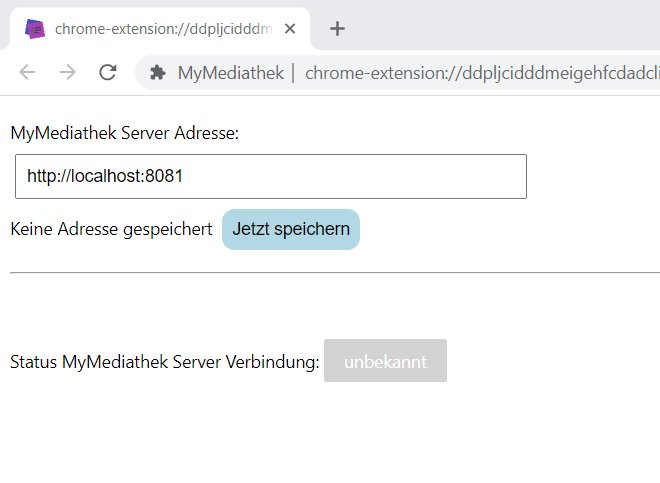
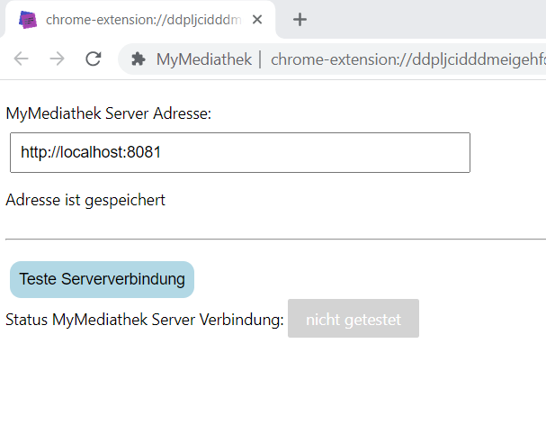
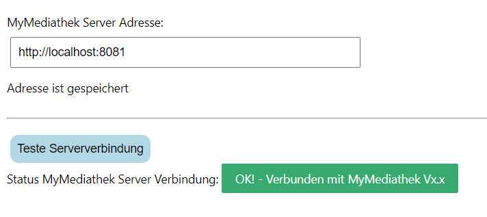

# MyMediathek - Webbrowser Add-On

[Übersicht](../README.MD) - [Installation](../docs/install.md) - [Bedienung](../docs/usage.md) -[Verwaltung und erweiterte Konfiguration](../docs/config.md) - Webbrowser Add-On - [Technische Details und Entwicklung](../docs/develop.md)
***

Es steht ein Webbrowser Add-on "MyMediathek" für FireFox und Google Chrome zur Verfügung, mit dem die Beiträge von den Seiten der ARD, ZDF, 3SAT und ARTE Mediatheken direkt in die Merkliste übernommen oder mit dem Standardplayer abgespielt werden können.

Die Add-ons können direkt aus den entsprechenden Web Stores im Browser installiert werden:

- Firefox: 
Das Add-on steht auf der Mozilla Add-on Seite [https://addons.mozilla.org/de/firefox/](https://addons.mozilla.org/de/firefox/addon/mymediathek) unter dem Namen '[MyMediathek](https://addons.mozilla.org/de/firefox/addon/mymediathek)' zur Verfügung.

- Google Chrome: 
Das Add-on kann im "chrome web store" unter  [Home > Extensions > MyMediathek](https://chrome.google.com/webstore/detail/mymediathek/ddpljcidddmeigehfcdadcligkonkndk) heruntergeladen und installiert werden.

Die Links auf die Add-ons stehen auch auf der Konfigurationsseite von 'MyMediathek' zur Verfügung (siehe ).

**Wichtig:** Nach der Installation **muss** noch die Serveradresse von 'MyMediathek' im Add-on konfiguriert werden, damit alle Funktionen zur Verfügung stehen.

 

## Konfiguration ##

 

### Firefox: ###

Die Seite zur Verwaltung der Erweiterungen aufrufen, entweder über das Anwendungsmenü oder in der Adressleiste 'about:addons' eingeben.

- In der Seite zum Add-on gehen und die Verwaltung des Add-ons aufrufen: Im Punktemenü auf Verwalten gehen:

  

- Unter 'Einstellungen' die Adresse des MyMediathek Servers eintragen:

  

  Und mit "Speichern" sichern.

  Anschließend kann mit dem Button "Teste Serververbindung" geprüft werden, ob der (richtige) Server erreicht werden kann.

 

### Google Chrome: ###

Die Seite zur Verwaltung der Erweiterungen aufrufen, entweder über das 'Einstellungsmenü -> Einstellungen -> Erweiterungen' oder in der Adressleiste 'chrome://extensions/' eingeben

- In der Seite zum Add-on gehen und die Details des Add-ons aufrufen: 

  

- Unter Details zu den Optionen gehen und öffnen

  

- In den Optionen die Adresse des MyMediathek Servers eintragen und speichern:

  

- Anschließend kann mit dem Button "Teste Serververbindung" geprüft werden, ob der (richtige) Server erreicht werden kann:

  

  Wenn alles in Ordnung ist kann die Seite geschlossen werden:

  

 

## Bedienung ##

Das Add-on fügt auf den Seiten der unterstützten Mediatheken einen Kontext Menü Eintrag 'Filminformation anzeigen ...' hinzu mit dem die Details zu dem Beitrag in einem Seitenfenster angezeigt werden, und von wo aus der Beitrag entweder in der Merkliste gespeichert oder gleich im Standardplayer von 'MyMediathek' abgespielt werden kann. 

  
  
***Hinweise***: 
- *Der Kontextmenüeintrag wird mit der rechten Maustaste geöffnet.* 
- *Der Kontextmenüeintrag wird den Links auf der Webseite hinzugefügt, nicht den Grafiken! Falls er bei einem Eintrag nicht sichtbar wird, ist entweder kein Link vorhanden oder dieser hat das falsche Format.*
  
Nach dem Anklicken erscheint die Seitenleiste mit den detaillierten Informationen zum gewählten Film:

   

 

Mit den entsprechenden Buttons kann dann der Film entweder direkt auf dem Standardplayer (z.B. Fernseher) abgespielt werden oder in der Merkliste für später gespeichert werden. 

***Hinweis***: 
- *Die Buttons sind nur verfügbar wenn der 'MyMediathek' Server konfiguriert und erreichbar ist.*

 

### Filmauswahl ###

Die Mediatheken stellen ihre Beiträge in mehreren Qualitätsstufen und teilweise in mehreren Sprachversionen zur Verfügung. Das Add-on selektiert automatisch die höchste Qualitätsversion und sofern vorhanden die deutsche Sprachversion. Spezielle Versionen wie Untertitel oder Audiobeschreibung werden nicht berücksichtigt.
