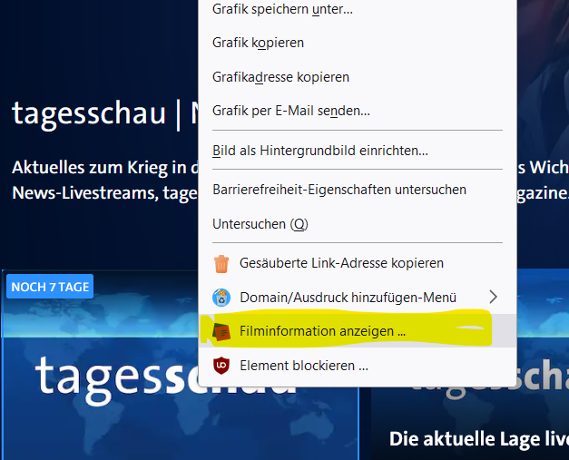

# MyMediathek - Firefox Add-On

[Übersicht](../README.MD) - [Installation](../docs/install.md) - [Bedienung](../docs/usage.md) -[Verwaltung und erweiterte Konfiguration](../docs/config.md) - Firefox Add-On - [Technische Details und Entwicklung](../docs/develop.md)
***

Über die Verwaltungsseite kann eine signiertes Firefox Add-on "MyMediathek" heruntergeladen werden, welches es ermöglicht Beiträge von den ARD, ZDF, 3SAT und ARTE Mediatheken direkt in die Merkliste zu übernehmen oder mit dem Standardplayer abzuspielen.

Hinweis: 
Das Addon steht auf der Mozilla Addon Seite [https://addons.mozilla.org/de/firefox/](https://addons.mozilla.org/de/firefox/addon/mymediathek) unter dem Namen '[MyMediathek](https://addons.mozilla.org/de/firefox/addon/mymediathek)' zur Verfügung.

 

## Installation in Firefox ##

- Beim Laden des Addons mit Firefox kann dieses dirkt installiert werden. Ansonsten nach dem Herunterladen im Firefox Add-on Menü die Option "Add-on aus Datei installieren" auswählen um das Add-on zu Firefox hinzufügen:

  

Damit das Addon mit 'MyMediathek' zusammen arbeitet, muß in diesem noch die Adresse des Servers eingetragen werden. Dazu:

- Die Verwaltung des Add-ons aufrufen - Im Punktemenü auf Verwalten gehen:

  

- Unter 'Einstellungen' die Adresse des MyMediathek Servers eintragen:

  

  Und mit "Speichern" sichern.

  Anschliesend kann mit dem Button "Teste Serververbindung" geprüft werden, ob der (richtige) Server erreicht wirden kann.

 

## Bedienung ##

Das Add-on fügt auf den Seiten der unterstützten Mediatheken einen Kontext Menü Eintrag 'Filminformation anzeigen ...' hinzu mit dem die Details zu dem Beitrag in einem Seitenfenster angezeigt werden, und von wo aus der Beitrag entweder in der Merkliste gespeichert oder gleich im Standardplayer von 'MyMediathek' abgespielt werden kann. 

  
  
Nach dem Anklicken erscheint die Seitenleiste mit den detaillierten Informationen:

   

Mit den entsprechenden Buttons kann dann der Film entweder direkt auf dem Standardplayer (z.B. Fernseher) abgespielt werden oder in der Merkliste für später gespeichert werden. 
