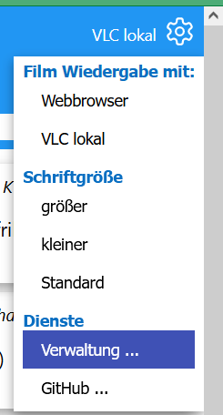
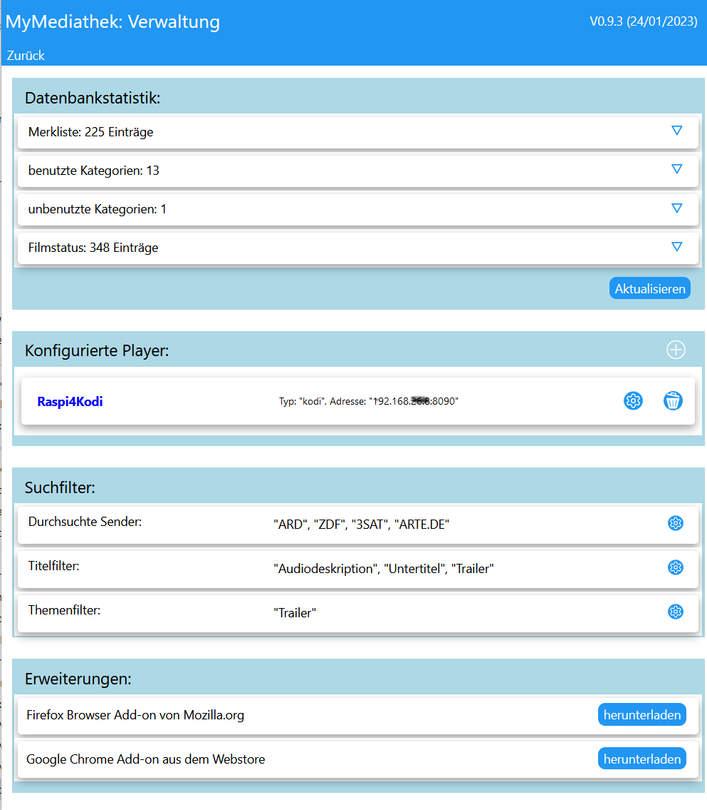
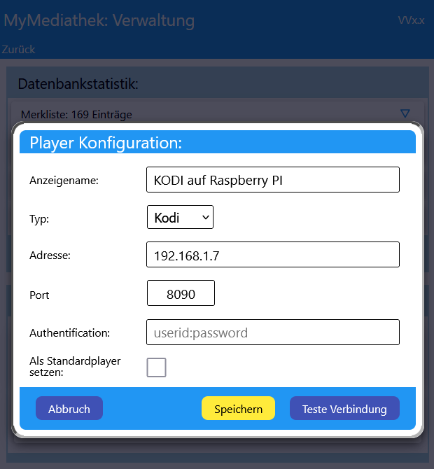
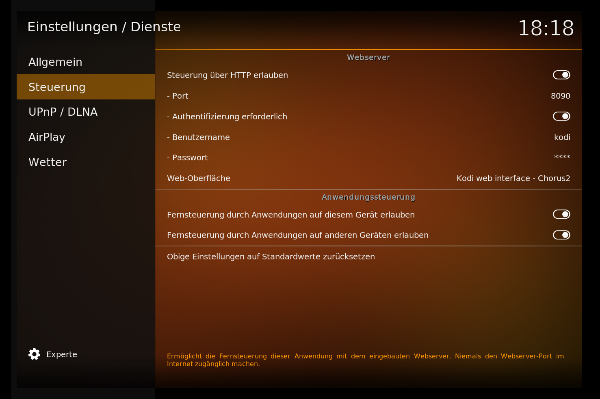
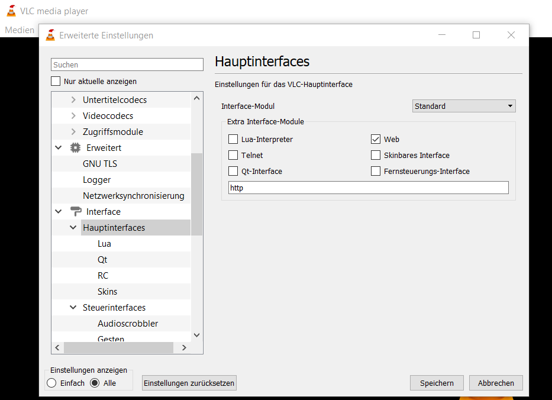
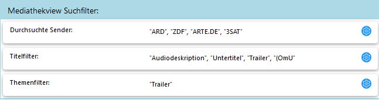

# MyMediathek - Verwaltung und erweiterte Konfiguration #

[Übersicht](../README.MD) - [Installation](../docs/install.md) - [Bedienung](../docs/usage.md) - Verwaltung und erweiterte Konfiguration - [Webbrowser Add-On](../docs/addon.md) - [Technische Details und Entwicklung](../docs/develop.md)
***

Das Verwaltungs- und erweiterte Konfigurationsseite kann von der Film- oder Merkliste aus über das Einstellungsmenü rechts oben (Zahnradsymbol) mit der Option "Verwaltung..." geöffnet werden:

  

Die Seite ist in folgende Rubriken unterteilt:

- [Datenbankstatistik](#datenbankstatistik)
- [Konfigurierte Player](#player-konfiguration)
- [Suchfilter](#standard-suchfilter)
- [Erweiterungen](#browser-addons)

  

  

## Datenbankstatistik ##
Hier werden statistische Daten zur Datenbank auf dem Server angezeigt und es besteht die Möglichkeit unbenutzte Kategorien und veraltete Daten zu löschen.

***Hinweis***:
*Durch Anklicken werden die Details der einzelnen Einträge sichtbar gemacht*.

 

## Player Konfiguration ##

MyMediathek unterstützt VLC und KODI als externe Player, wenn diese vom *Webserver* aus über HTTP erreichbar sind. Damit ist es zum Beispiel möglich Filme über den Fernseher wiederzugeben, wenn KODI an diesen angeschlossen ist.

Ein Player wird im Verwaltungsmenü eingerichtet, durch Anklicken des plus Zeichens in der Sektion 'Konfigurierte Player' öffnet sich der Konfigurationsdialog:

  

- Der Name kann frei vergeben werden und dient zur Anzeige im Auswahlmenü.
- Falls keine Benutzerkennung und Passwort benötigt werden kann das Feld freibleiben.
- Standardplayer bedeutet, dass dieser Player voreingestellt wird, wenn die Webseite neu geladen wird.

Es sollte vor dem Abspeichern auf jeden Fall mit dem Test Button geprüft werden, ob der Player angesprochen werden kann.

Damit MyMediathek den Player ansprechen kann, muss dieser eine externe Steuerung über HTTP zulassen:

 

### **KODI Steuerung einrichten** ###

- Im KODI muss unter 'Einstellungen'-'Dienste' die Steuerung über HTTP erlaubt werden:
  
  

- In demselben Menü kann auch der Benutzername, Passwort und Port eingestellt werden.

 

### **VLC Steuerung einrichten** ###
- Im VLC muss in den erweiterten Einstellungen ('Werkzeuge'-'Einstellungen', hier 'Einstellungen anzeigen': alle auswählen) das Web Interface aktiviert werden:

  

  (siehe auch [VLC Wiki](https://wiki.videolan.org/Documentation:Modules/http_intf/#VLC_2.0.0_and_later))

- Im Menüpunkt 'Interface'-'Hauptinterfaces'-'LUA' sollte dann noch ein Passwort für den Zugriff festgelegt werden.
- Der Standard Port für VLC ist 8080, er kann in den erweiterten Einstellungen über den Menüpunkt 'Eingang/Codecs' geändert werden (Nach unten scrollen bis die Netzwerkeinstellungen sichtbar werden und den 'HTTP Server Port' anpassen).

 

## Standard Suchfilter ##

Hier besteht die Möglichkeit Standardfilter für die Suche nach Beiträgen zu definieren, die verwendet werden, wenn in der Suchleiste nichts Gegenteiliges angegeben wird:

Folgende Filter sind möglich:

- Durchsuchte Sender: 

  Hier kann eine Liste von Sendernamen angegeben werden, in denen nach Filmen gesucht wird ('Allowlist'). Der Sendername kann auch nur teilweise definiert werden, dann werden alle Sender die passen genommen, Z.B. 'ARTE' entspricht 'ARTE.de' und 'ARTE.fr', 'SR' gibt alle Beiträge von 'SR' und 'SRF' zurück.

- Titelfilter:

  Beiträge in deren Title einer der Begriffe vorkommt werden nicht angezeigt ('Blocklist'). Damit können z.B. untertitelte Sendungen ausgefiltert werden, wenn im Title der Begriff vorkommt.

- Themenfilter:

  Gleiche Funktion wie beim Titelfilter, nur für das Themenfeld. 

 

## Erweiterungen ##

Hier stehen Links zum Laden der Browser Erweiterungen zur Verfügung (siehe auch [Webbrowser Add-On](../docs/addon.md)) 
