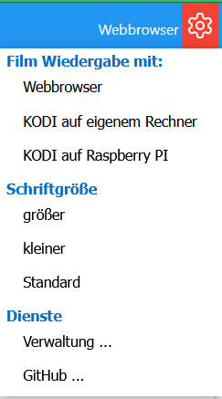

# MyMediathek - Bedienung #
[Übersicht](../README.MD) - [Installation](../docs/install.md) - Bedienung -[Verwaltung und erweiterte Konfiguration](../docs/config.md) - [Firefox Add-On](../docs/addon.md) - [Technische Details und Entwicklung](../docs/develop.md)
***

Nach der Installation und Start kann mit dem Browser die Weboberfläche unter 'Rechneradresse:8081' aufgerufen werden (z.B. localhost:8081). Beim Aufruf wird die aktuelle Filmliste des [MediathekView Projekts](https://mediathekview.de/) angezeigt.

 

## Filmliste ##
Die Standardansicht der Filmliste ist alle Beiträge absteigend nach Sendedatum sortiert, die Beiträge werden in kompakter Form angezeigt. Die Sortierung kann über den entsprechenden Menüeintrag geändert werden.

Durch Anklicken einer Kachel werden erweiterte Information, wie Inhaltsangabe, Sendedatum dargestellt, und falls vorhanden das Ablaufdatum und passende Bild aus den Mediatheken geladen (letzteres nur für ARD, ZDF, ARTE und 3SAT). 

Es kann auch im Menü die Ausgabe auf 'erweitert' umgeschaltet werden, dann werden Sendedatum und Beschreibung immer mit angezeigt. Die erweiterte Information aus den Mediatheken wird  mit einem Mausklick verfügbar, da sie erst aus den Mediatheken extrahiert werden muss.   

Bestimmte Beiträge können über die Sucheingabe gesucht werden, wobei hier meistens die Eingabe der entsprechenden Begriffe ausreicht, z.B. 'Tatort'. Zusätzlich können noch erweiterte Such- und Filteroptionen verwendet werden, um die relevanten Beiträge anzuzeigen.

 

### Such- und Filteroptionen: ###

- **'![sender][,sender]' - Filter nach Sender** : 

   Es können ein oder mehrere Sender angeben werden, z.B. !ARD zeigt nur ARD Beiträge !ARD,ZDF zeigt Beiträge von beiden Sendern.

   *Hinweis: Standardmäßig ist der Filter '!ARD,ZDF,3SAT,ARTE.DE' voreingestellt und wird verwendet, wenn kein Filter angegeben wird. Um trotzdem alle Beiträge aller Sender anzuzeigen kann einfach der Filter '!' ohne Senderliste verwendet werden. Der Standardfilter kann über die =>[Verwaltungsseite](#verwaltung) gelöscht oder geändert werden*

- **'#begriff[,begriff]' - Filter nach Thema** :

  Es können Begriffe angegeben werden, die im Thema vorkommen sollen, z.B. '#Tatort' zeigt alle Beiträge an die im Thema den Begriff 'Tatort' verwenden. Mehrere Begriffe können durch Komma getrennt angegeben werden, sie müssen dann alle im Thema vorkommen ('UND' Operation), z.B. '#Ausland,extra' zeigt alle Beiträge wie "Auslandsjournal extra", "extra im Ausland", usw. an.

- **'+begriff[,begriff]' - Filter nach Titel** :

  Es können Begriffe angegeben werden, die im Titel vorkommen sollen, z.B. '+Mallorca' zeigt alle Beiträge an die im Title den Begriff 'Mallorca' verwenden. Mehrere Begriffe können durch Komma getrennt angegeben werden, sie müssen dann alle im Mallorca vorkommen.

- **'\*begriff,[begriff]' - Filter nach Begriffen in der Beschreibung** :

  Es können Begriffe angegeben werden, die in der Beschreibung vorkommen sollen, z.B. '*Mallorca' zeigt alle Beiträge, bei denen in der Beschreibung 'Mallorca' vorkommt. Mehrere Begriffe können durch Komma getrennt angegeben werden, sie müssen dann alle in der Beschreibung vorkommen.

- **'\<minuten' oder '\>minuten' - Filter nach Länge** 

  Es kann nach der Filmlänge gefiltert werden, z.B. '>80' zeigt nur Beiträge an die länger als 80 Minuten sind, '<5' entsprechend Beiträge kürzer als 5 Minuten.

- **'++' - Zukünftige Sendungen**' :

  Standardmäßig werden nur Sendungen bis zum aktuellen Datum angezeigt. Um Sendungen aus der Mediathek die erst in Zukunft laufen werden mit anzuzeigen kann in der Suchleiste '++' als Filter angegeben werden.

 

### Merken und Abspielen von Filmen ###

Jeder Beitrag zeigt, wenn ausgeklappt drei Buttons:

-  Merken des Beitrags in der Merkliste. Es wird ein Dialog geöffnet, mit dem der Beitrag vor dem Speichern einer Kategorie zugeordnet werden kann. Ein Beitrag der in der Merkliste ist wird mit lila Hintergrund markiert, und kann durch den Button wieder entfernt werden.

-  Der Beitrag wird im (Standard)Player abgespielt.

-  Der Beitrag wird als gesehen markiert. Gesehene Beiträge (grüner Hintergrund) können mit dem Button wieder als ungesehen markiert werden.

*Hinweis zur Filmqualität*:

In den Mediatheken liegen die Filme in verschiedenen Qualitäten und teilweise in verschiedenen Sprachversionen vor. 'MyMediathek' versucht immer die Referenz auf die deutsche Film Version mit der höchstmöglichen Qualität abzuspeichern. Dieses Verhalten ist der jetzigen Version festgelegt und (noch) nicht konfigurierbar.

  

## Merkliste ##

Die Merkliste zeigt in der Standardansicht alle gemerkten Beiträge sortiert nach Ablaufdatum aufsteigend an. Über die Menüs kann die Anzeige auf bestimmte Kategorien begrenzt ('Auswahl') und die Sortierung geändert werden. Die Ansichtsoption erlaubt es die Anzeige auf gesehene oder ungesehene Beiträge zu begrenzen.

Abhängig vom Zustand werden die Filme farbig gekennzeichnet:

- grüner Hintergrund oder grüne Titelleiste: Beitrag wurde gesehen
- oranger Hintergrund: Beitrag ist nur noch 5 Tage oder kürzer in der Mediathek verfügbar.
- roter Hintergrund: Beitrag ist nicht mehr in der Mediathek verfügbar (Erfahrung zeigt das solche Beiträge manchmal doch noch abgerufen werden können)
- gelblicher Hintergrund: Es konnte kein Verfügbarkeitsdatum gefunden werden.

Jeder Beitrag in der Merkliste zeigt die folgenden Buttons:
-  Der Beitrag wird im (Standard)Player abgespielt.
-  Löschen des Beitrages aus der Merkliste
-  Öffnet ein Kontextmenü, in dem der Beitrag als gesehen bzw. ungesehen gekennzeichnet werden, die Kategorie oder das Ablaufdatum geändert werden kann.

  

## Player Auswahl ##

Standardmäßig werden die Beiträge im Webbrowser abgespielt, sofern keine externen Player konfiguriert sind. Über das Einstellungsmenü rechts oben auf der Film- oder Merkliste kann die Verwaltungsseite geöffnet werden, in der externe Player konfiguriert werden (siehe [MyMediathek Verwaltung - Player Konfiguration](../docs/config.md#playerconfig)).

Sobald zusätzliche Player eingerichtet sind können diese im Einstellungsmenü ausgewählt werden. der aktuelle Player wird in der Titelzeile der Seite angezeigt: 

